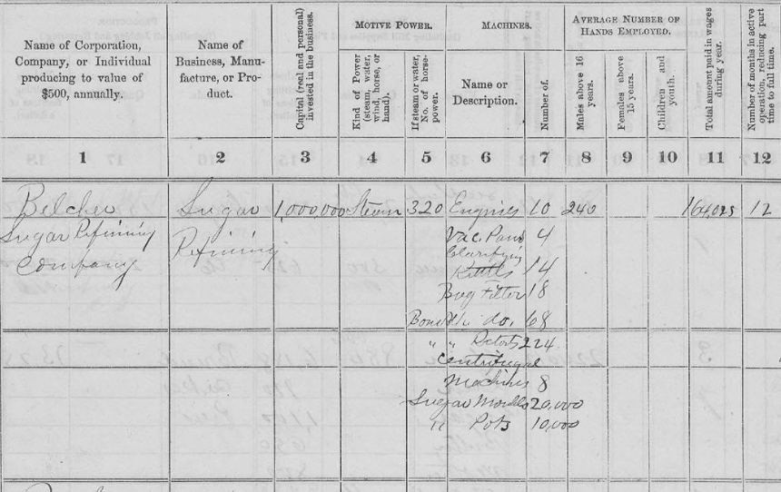

<header>
  <h1>Historical Census of Manufactures Microdata</h1>
</header>

  
  

  <a href="get-data.html">Get the data</a>
  <a href="about.html">About the data</a>
  <a href="explore.html">Explore the data</a>

